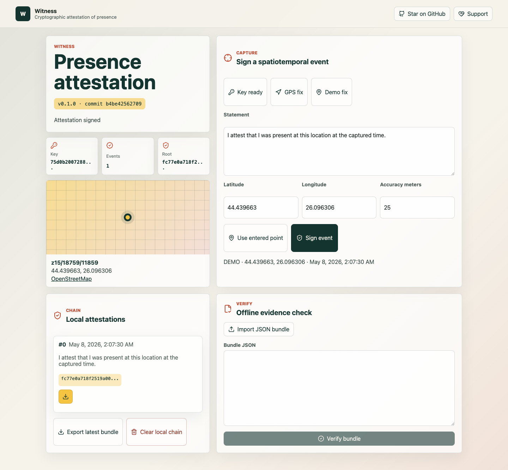
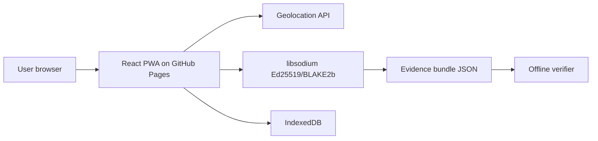

# Witness Attestation


Live site:

https://baditaflorin.github.io/witness-attestation/

Repository:

https://github.com/baditaflorin/witness-attestation

Support:

https://www.paypal.com/paypalme/florinbadita

Witness Attestation is a client-side PWA for signing GPS/time observations into verifiable, portable presence attestations.



## Quickstart

```sh
npm install
make install-hooks
make dev
make test
make smoke
```

## What V1 Does

- Generates an Ed25519 keypair locally with libsodium.
- Captures GPS, manual, or demo coordinates in the browser.
- Signs canonical spatiotemporal payloads, links them with a hashchain, and exports JSON evidence bundles with a Merkle root.
- Verifies exported bundles offline in the same static app.
- Shows the live repository link, PayPal support link, version, and current public commit on the GitHub Pages site.

## Important Limits

Witness verifies signatures, payload hashes, hashchain continuity, and Merkle roots. It does not prove that a phone GPS sensor was impossible to spoof, that the device clock was authoritative, or that a court will accept an exported bundle without surrounding evidence.

## Architecture



## Documentation

Architecture overview:

docs/architecture.md

Architecture decisions:

docs/adr/

Deployment guide:

docs/deploy.md

Privacy notes:

docs/privacy.md

Evidence bundle contract:

docs/evidence.md

## Development

No GitHub Actions are used. Checks run locally through Make targets and git hooks.

```sh
make lint
make test
make build
make smoke
```

Do not commit secrets, private keys, `.env` files, GPS history exports, or personal evidence bundles.
