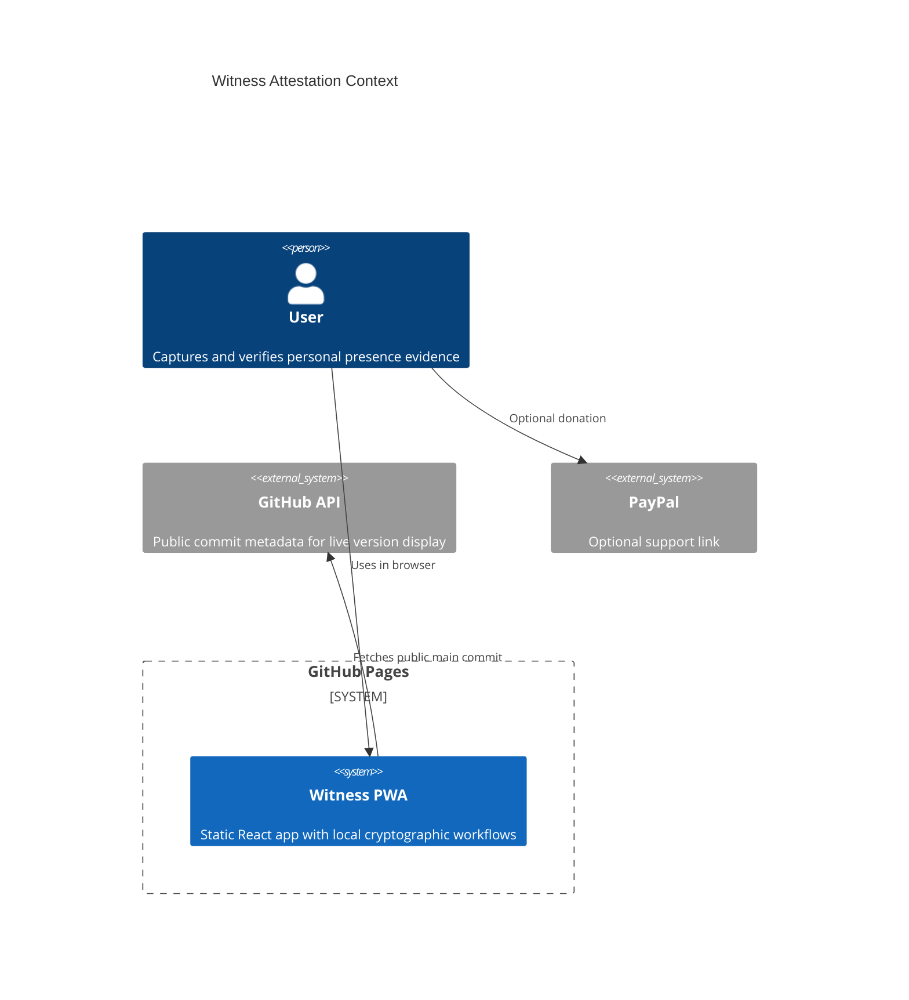
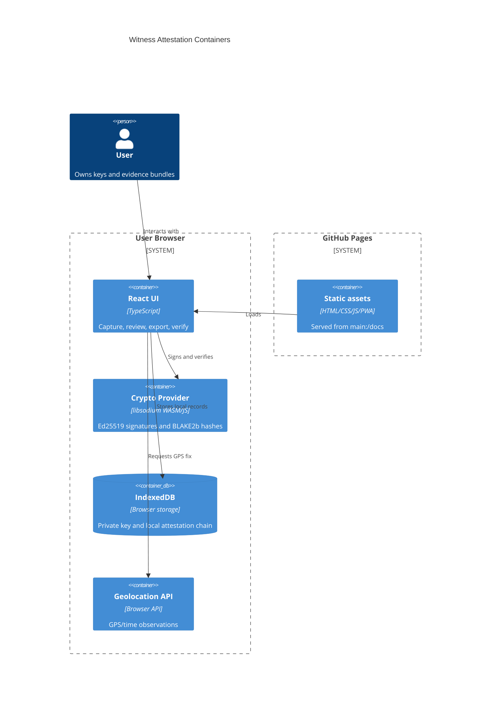

# Architecture

Live site:

https://baditaflorin.github.io/witness-attestation/

Repository:

https://github.com/baditaflorin/witness-attestation

## Context

```mermaid
C4Context
  title Witness Attestation Context
  Person(user, "User", "Captures and verifies personal presence evidence")
  System_Boundary(pages, "GitHub Pages") {
    System(app, "Witness PWA", "Static React app with local cryptographic workflows")
  }
  System_Ext(github, "GitHub API", "Public commit metadata for live version display")
  System_Ext(paypal, "PayPal", "Optional support link")
  Rel(user, app, "Uses in browser")
  Rel(app, github, "Fetches public main commit")
  Rel(user, paypal, "Optional donation")
```

## Container

```mermaid
C4Container
  title Witness Attestation Containers
  Person(user, "User", "Owns keys and evidence bundles")
  System_Boundary(browser, "User Browser") {
    Container(ui, "React UI", "TypeScript", "Capture, review, export, verify")
    Container(crypto, "Crypto Provider", "libsodium WASM/JS", "Ed25519 signatures and BLAKE2b hashes")
    ContainerDb(idb, "IndexedDB", "Browser storage", "Private key and local attestation chain")
    Container(geo, "Geolocation API", "Browser API", "GPS/time observations")
  }
  System_Boundary(pages, "GitHub Pages") {
    Container(static, "Static assets", "HTML/CSS/JS/PWA", "Served from main:/docs")
  }
  Rel(user, ui, "Interacts with")
  Rel(ui, crypto, "Signs and verifies")
  Rel(ui, idb, "Stores local records")
  Rel(ui, geo, "Requests GPS fix")
  Rel(static, ui, "Loads")
```
